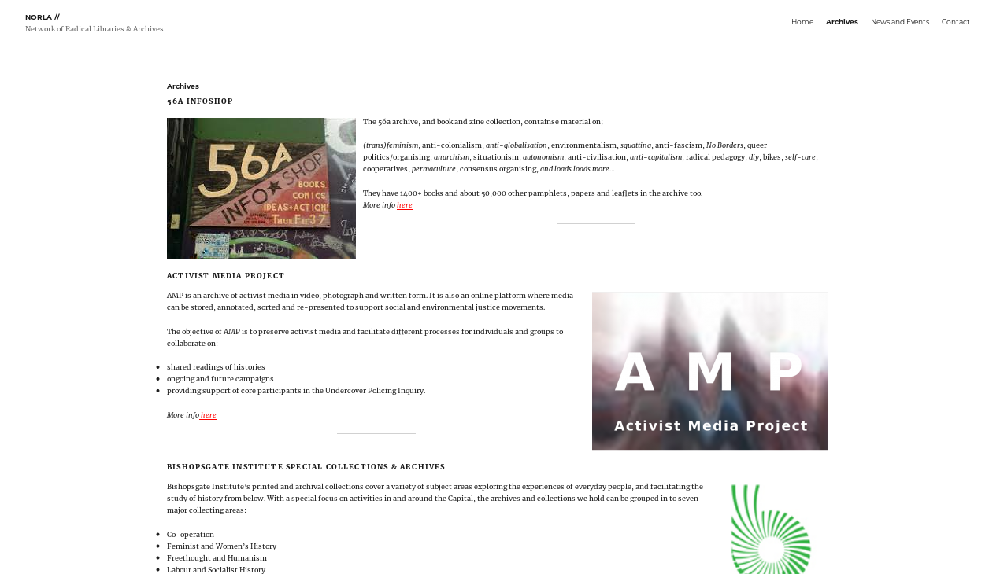

### cobox.cloud
Building Blocks for a Cooperative Cloud

---

### CoBox is
* The foundations of a peer-to-peer commons cloud infrastructure
* An innovative suite of open hardware and software providing:
  * a physical box: plug and play server 
  * a suite of cooperative tools: privacy enhancing decentralised governance tools
  * a peer-to-peer cloud: ensuring data sovereignty, availability, resilience and back-up

---

### What does CoBox do?

* builds on the historic tendency for networks of coops to collaborate. 
* leverages the benefits of self-hosting combined with peer-to-peer technologies to share responsibilities of maintaining a secure & resilient cloud.

---

### Why CoBox?

* Ambitious
* State of the art
* Privacy-by-design
* Peer-to-peer
* Decentralised data governance
* Data sovereignty
* Cooperative cloud
* Federated networks

---

#### The CoBox Team - **Research**
### Jaya Klara Brekke 
* Published expert on the political-economies and ethics of decentralized algorithmic governance
* PhD from Durham University on the politics and powerdynamics of blockchain
* Extensive experience with Agile/LEAN and co-design methods
* User-requirements researcher on the D-CENT project https://dcentproject.eu/)

---
#### The CoBox Team - **Developer** 
### Kieran Gibb 
* 6 years expertise developing for SMEs and co-ops
* co-conceived peer-based key backup software Dark Crystal
* open-source contributor to Secure Scuttlebutt ecosystem
* member of London-based art collective Agorama Server Co-op
* experimenting with Dat to seed community hosting infrastructure

---
#### The CoBox Team - **Business Development**
### Mooness Davarian 
* 5 years coordinating European youth on horizontal organising, environmental awareness + anti-racism
* 5 years in decentralised secure communications
* Worked with Panoramix + NEXTLEAP EU H2020 Consortiums 
* Works with developers to source funds, build networks, administer finances + deliver reports.
* Long member of London Social Centers Network + German Mietshauser Syndikat
---
### Our Experience
  
* Loomio collaborative decision-making tool
* CoBudget collaborative finance tool
* D-CENT H2020 Consortium
* DECODE H2020 Consortium
* Panoramix H2020 Consortium
* NEXTLEAP H2020 Consortium
---
### Our Experience
* London Social Centers Network
* Networked Radical Archives
* Agorama Server Coop
* Secure Scuttlebutt peer-to-peer social network
* Mietshauser Syndikat housing cooperative network
  
  
We are all experienced in effective collaboration and know how to work as a team. We are a high-EQ group, emphasising the human elements of what it takes to make great software, backed up by technical expertise.

---

### The Market

#### Cooperative Sector 
* Europe has over 170.000 cooperatives with an annual turn-over of more than €1000bn (Cocolina, 2016).
* Many are already organised into sector-specific networks
* Networks have existing conferences, events and communications channels 

---
### Our Partners - **CoTech**

CoTech is a network of technology cooperatives that operate on fully democratic principles. https://www.coops.tech/

---

### Our Partners - **Norla**
The network of radical archives is a European wide initiative (with connections to India and the US) to coordinate and share resources amongst archives that look to preserve and record histories of social movements, experimental culture and marginalised figures and groups. http://norla.org/

---

---

### The Problem

Co-operatives face a significant challenge of divesting from proprietary software and aligning their web infrastructure with the principles of self-organised, autonomous, and democratic collaboration. Outsourcing data storage to either corporate or non-commercial NfP initiatives ultimately means data assets and their derived knowledge is not in the hands of its creators.

---

### Our Solution
        

* CoBox leverages the latest innovations in micro-computing, decentralised networking and data replication technologies for co-operatives to mutually host and seed secure data storage - the foundations of a peer-to-peer commons cloud infrastructure. 

* Our software places privacy-by-design at the forefront of its innovation, using modern cryptography to ensure data sovereignty from the level of the individual to the co-operative and beyond.

---
### Our Solution

* CoBox provides an interoperable suite of tools for common coordination (decision-making, governance and accounting software), and offers integration for collaborative office software (documents, spreadsheets, calendars):

Note:

---

### Loomio example

---

### CoBudget example

---

### CoBudget Platform Coop (like the Enspiral Foundation)

---

### Business Model

The CoBox business model is inspired by these projects:
* SaaS: https://www.loomio.org/pricing
* Optional hashbase: https://hashbase.io/pricing
* Federation membership dues: https://mayfirst.org/en/membership-agreement/

---
### Stakeholders include:
* The cooperatives purchase and deploy the CoBox cooperative cloud
  * Coops can run independent or combined networks
* The open source software projects that are pre-installed on the box (Dat, Loomio, Dark Crystal, Cobudget)
  * We are well networked with these projects

---

### Financial Projection
* Year: 4
* Sales: 600 boxes sold @ 35euro each
* CoBox Users: 500 coops engaged in the network
* SaaS Clients: 200 SaaS contracts
  * 100 small orgs (490e/yr each)
  * 70 medium orgs (1490e/yr each)
  * 30 large orgs (4490e/yr each)
* Hashbase option: 200 coops @ 7e/month each
* CoBox Federation Members: 50 coops @ 100e/yr
* Profit: 330,000
* Employees: 10

---

### Metrics

* Like the cooperatives that we aim to serve, CoBox will not be solely profit-driven. 
* Our measurement metrics are adapted from other open source, p2p and cooperative community projects.

---

### Metrics

- Measuring peer-engagement and network growth:
  - i. Increase in size of network
  - ii. Increase in internal connectivity
  - iii. Increase in connections to valuable third parties

---

### Metrics
- Measuring share ratio so peers can recognise their own contributions. 
- Happiness-unhappiness continuum will measure the health of peer relationships.
- Transparency of governance will evaluate the CoBox team's responsiveness and commitment to the network.
- Profit will be measured towards sustainable and self-sustaining growth.

---

Thanks for coming to our TED Talk: Ursula LeGuin vs. Ayn Rand; Go!
